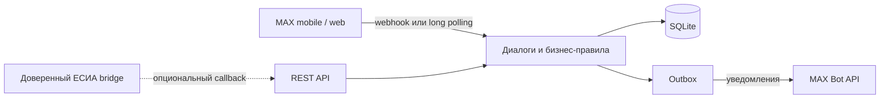

# ДомПульс

**ДомПульс — бот в MAX, который превращает сообщение о проблеме в доме в понятную заявку с ответственным, сроком реакции и видимым результатом.**

Жителю не нужно искать телефон диспетчерской или выяснять в домовом чате, приняли ли его сообщение. Он описывает проблему прямо в MAX, прикладывает фотографию и следит за статусом. Диспетчер работает там же: видит очередь своего дома, отвечает жителю, меняет статус и объединяет повторные сообщения в общий инцидент.

Основной сценарий полностью работает в чате MAX на мобильном устройстве и в веб-версии. Отдельная веб-панель диспетчера для демонстрации не нужна.

## Что можно показать на защите

- привязку жителя и диспетчера к дому по одноразовому коду;
- добавление нескольких домов и переключение активного адреса;
- создание обращения с категорией, местом, описанием и фотографиями;
- очередь диспетчера, приоритет, комментарии и смену статусов;
- уведомления жителя и подтверждение результата или возврат заявки в работу;
- объединение похожих обращений в общий инцидент только после решения диспетчера;
- объявления, сведения об управляющей компании и показатели дома;
- контроль времени первой реакции по SLA.

## Какую проблему решает проект

Типичная ситуация начинается просто: в подъезде течёт труба, не работает лифт или пропало отопление. Житель пишет в общий чат. Через несколько сообщений уже непонятно, зарегистрирована ли проблема, кто ею занимается и когда ждать результат. Соседи создают дубли, а диспетчер вручную собирает контекст из переписки.

ДомПульс заменяет этот разрозненный процесс одним коротким маршрутом:

```text
сообщение жителя → зарегистрированная заявка → реакция УК → работа → проверка результата жителем
```

Основная аудитория MVP — жители многоквартирных домов, которые уже пользуются MAX. Вторая сторона сценария — диспетчеры УК и ТСЖ. Для них бот создаёт общую очередь и историю действий без перехода в отдельную систему.

## Основной пользовательский сценарий

1. Житель запускает бота и подтверждает дом одноразовым кодом УК. В будущем этот шаг может проходить через официальный контур ЕСИА.
2. В меню он нажимает **«Сообщить о проблеме»**, выбирает категорию, указывает место, описывает ситуацию и при необходимости прикладывает фото.
3. Перед отправкой бот показывает итог. Заявка создаётся только после подтверждения жителя.
4. Диспетчер открывает **«Очередь дома»**, отвечает жителю, назначает срочность и ведёт заявку по этапам: `новое → принято → в работе → ожидает проверки`.
5. Житель получает уведомления в MAX и выбирает: **«Да, всё решено»** или **«Проблема осталась»**.
6. Если несколько жителей сообщают об одной проблеме, диспетчер может подтвердить общий инцидент. Другим жителям бот предлагает добровольно присоединиться или создать отдельную заявку.

Житель может привязать несколько домов. Новые обращения, объявления и информация об УК относятся к выбранному активному дому, а история обращений сохраняется при переключении и отвязке адреса.

## Гипотеза и измеримый эффект

Мы проверяем гипотезу, что структурированный сценарий внутри привычного мессенджера уменьшает время неопределённости для жителя и ручную работу диспетчера с повторами.

На пилоте эффект можно измерять по данным самого ДомПульса:

- медианное время до первой реакции УК;
- доля обращений с реакцией в пределах SLA;
- доля обращений, подтверждённых жителями после выполнения;
- число возвратов в работу;
- число повторных сообщений, объединённых в общие инциденты;
- доля пользователей, завершивших создание заявки.

Это показатели для проверки гипотезы, а не заявленные результаты внедрения. Целевые значения определяются вместе с пилотной УК после фиксации исходного уровня.

## Что уже реализовано

| Возможность | Житель | Диспетчер |
|---|---:|---:|
| Привязка к разрешённому дому | ✓ | ✓ |
| Несколько домов в одном профиле | ✓ | — |
| Заявка с фотографиями | ✓ | просмотр |
| История и карточка обращения | свои заявки | заявки доступных домов |
| Ответ без смены статуса | получает | отправляет |
| Приоритет и жизненный цикл | видит | управляет |
| Подтверждение результата | ✓ | получает результат |
| Общие инциденты | присоединяется добровольно | подтверждает |
| Объявления дома | читает | публикует |
| Информация об УК | читает | настраивается администратором |
| SLA и показатели | — | ✓ |

## Быстрый запуск без Docker

Понадобятся Python 3.12+, токен бота MAX и PowerShell. Из корня репозитория выполните:

```powershell
python -m venv .venv
.\.venv\Scripts\python.exe -m pip install -r requirements-dev.txt
Copy-Item .env.example .env
notepad .env
```

В `.env` достаточно заполнить токен:

```dotenv
MAX_BOT_TOKEN=ваш_токен_бота
```

Создайте синтетические данные и два кода доступа к первому дому:

```powershell
.\.venv\Scripts\python.exe -m app.seed --db .local/dompulse.db
.\.venv\Scripts\python.exe -m app.enrollment --db .local/dompulse.db --house-id house-1 --role resident
.\.venv\Scripts\python.exe -m app.enrollment --db .local/dompulse.db --house-id house-1 --role operator
```

Запустите бота:

```powershell
.\.venv\Scripts\python.exe -m app.polling
```

Откройте своего бота в MAX, отправьте `/start`, затем введите выданный код в формате `/код XXXX-XXXX-XXXX-XXXX`. Для демонстрации обеих ролей нужны два аккаунта MAX либо два участника команды.

Если у бота раньше был настроен webhook, переключите его на локальный polling:

```powershell
.\.venv\Scripts\python.exe -m app.polling --delete-webhooks
```

Останавливается бот сочетанием `Ctrl+C`, повторный запуск выполняется той же командой `python -m app.polling`. Одновременно для одного токена и одной базы следует использовать только один транспорт: polling или webhook.

## Запуск в Docker

Понадобятся Docker Engine с Compose и заполненный `.env`. Для Docker кроме `MAX_BOT_TOKEN` укажите непредсказуемый локальный секрет в `MAX_WEBHOOK_SECRET`.

Первый раз создайте тестовую базу и коды:

```powershell
docker compose run --rm api python -m app.seed --db /data/dompulse.db
docker compose run --rm api python -m app.enrollment --db /data/dompulse.db --house-id house-1 --role resident
docker compose run --rm api python -m app.enrollment --db /data/dompulse.db --house-id house-1 --role operator
```

Одна команда запускает все локальные компоненты для демонстрации через polling:

```powershell
docker compose --profile polling up --build -d
```

Проверить состояние и посмотреть журнал:

```powershell
docker compose --profile polling ps
docker compose --profile polling logs -f max-polling
```

Остановка и повторный запуск:

```powershell
docker compose --profile polling down
docker compose --profile polling up -d
```

Данные остаются в именованном томе `dompulse-data`. Команда `down -v` удаляет и тестовую базу, поэтому для обычной остановки она не нужна.

## Пошаговая проверка

1. Житель вводит свой код и получает главное меню.
2. Нажимает **«Сообщить о проблеме»** и создаёт заявку, например: отопление, подъезд 1, «Холодные батареи со вчерашнего дня».
3. Бот отвечает: `Обращение №… зарегистрировано и передано в очередь дома`.
4. Диспетчер вводит свой код, открывает очередь и карточку нового обращения.
5. Диспетчер отправляет ответ, принимает заявку, переводит её в работу и отмечает выполненной.
6. Житель видит историю и подтверждает решение либо возвращает заявку.
7. Для проверки нескольких домов выпустите жителю второй код с `--house-id house-2`, откройте **«Мои дома»** и переключите активный адрес.
8. Для проверки общего инцидента создайте похожие обращения от двух жителей, затем подтвердите найденное совпадение из меню диспетчера.

Расширенный сценарий защиты: [docs/demo-scenario.md](docs/demo-scenario.md).

## Архитектура



Проект сделан как модульный монолит. REST API и транспорт MAX используют одни правила доступа и одну модель заявок. Входящее событие, состояние диалога и исходящий ответ записываются транзакционно; повторные сообщения MAX дедуплицируются. Outbox отдельно доставляет уведомления и повторяет временно неудачные запросы.

Основные компоненты:

- `app/max_webhook.py` — сценарии жителя и диспетчера;
- `app/polling.py` — локальный запуск бота без публичного сервера;
- `app/api.py` — REST API, webhook и интеграционные точки;
- `app/outbox.py` — доставка сообщений в MAX;
- `app/db.py` и `app/models.py` — схема SQLite и контракты;
- `app/sla.py` и `app/analytics.py` — сроки первой реакции и показатели;
- `tests/` — проверки API, MAX, polling, ролей и безопасности.

Подробное описание: [docs/architecture.md](docs/architecture.md).

## Окружение, порты и зависимости

| Параметр | Значение |
|---|---|
| Python | 3.12+ |
| Docker | Docker Engine с Compose v2 |
| Локальная база | SQLite, по умолчанию `.local/dompulse.db` |
| HTTP API | `127.0.0.1:8080` |
| Swagger UI | `http://127.0.0.1:8080/docs` |
| Health check | `http://127.0.0.1:8080/health` |
| Входящие порты для polling | не требуются |

Версии Python-библиотек зафиксированы в [requirements.txt](requirements.txt), зависимости разработки — в [requirements-dev.txt](requirements-dev.txt). Основные библиотеки: FastAPI, Uvicorn, HTTPX, aiosqlite и certifi.

## Переменные окружения

| Переменная | Обязательна | Назначение |
|---|---:|---|
| `MAX_BOT_TOKEN` | да | токен бота MAX |
| `MAX_API_BASE` | нет | адрес MAX API; по умолчанию `https://platform-api2.max.ru` |
| `DOMPULSE_DB` | нет | путь к SQLite; по умолчанию `.local/dompulse.db` |
| `MAX_WEBHOOK_SECRET` | для API/webhook и Docker | секрет проверки входящего webhook |
| `GOSUSLUGI_BRIDGE_URL` | нет | HTTPS-адрес доверенного адаптера ЕСИА |
| `GOSUSLUGI_BRIDGE_SECRET` | вместе с bridge URL | HMAC-секрет длиной не менее 32 символов |
| `YANDEX_MAPS_API_KEY` | нет | ключ Геокодера Яндекса для проверки адреса |
| `YANDEX_GEOCODER_URL` | нет | адрес API геокодера |
| `YANDEX_MAPS_ALLOW_STORAGE` | нет | разрешение сохранять ответ геокодера при подходящей лицензии |
| `SSL_CERT_FILE`, `SSL_CERT_DIR` | нет | доверенный CA для нестандартной локальной среды |

Реальные токены, секреты, `.env`, локальные базы и сертификаты не добавляются в Git.

## Реальные и модельные интеграции

| Контур | Статус в MVP | Как проверить |
|---|---|---|
| MAX Bot API | реальная интеграция | запуск через polling или webhook с выданным токеном |
| SQLite | реальное локальное хранилище | создаётся командой `app.seed` |
| REST API | работает локально | Swagger и `openapi.json` |
| Госуслуги / ЕСИА | подготовлена граница доверенного bridge; официальный OAuth не входит в репозиторий | без bridge используется одноразовый код УК |
| Геокодер Яндекса | опциональная реальная проверка адреса при наличии ключа | без ключа основной сценарий продолжает работать по коду УК |
| ГИС ЖКХ и внутренняя система УК | не подключены и не имитируются | данные УК и домов в seed синтетические |

ДомПульс не выдаёт ручной ввод адреса за подтверждение права проживания. Геокодер проверяет адрес, после чего всё равно требуется код УК. Для промышленного подключения Госуслуг нужны зарегистрированная информационная система, полномочия ЕСИА и внешний аттестованный адаптер.

## Работа с данными и доступом

- Seed создаёт вымышленные дома, УК и пользователей. Файл `.local/local-test-users.json` содержит только локальные тестовые токены.
- Житель видит свои обращения во всех подтверждённых домах. Диспетчер видит только назначенные ему дома или округа.
- Коды привязки имеют срок действия и ограничение числа использований; в базе хранится хеш кода.
- Фотографии передаются как вложения MAX. В SQLite сохраняются идентификаторы и метаданные, бинарные файлы не копируются.
- При `YANDEX_MAPS_ALLOW_STORAGE=false` ответ Геокодера Яндекса не сохраняется.
- Bridge ЕСИА передаёт минимальный адресный claim через HMAC-подписанный callback; токены ЕСИА и полный адрес квартиры в ДомПульсе не хранятся.

Подробнее: [docs/data-and-integrations.md](docs/data-and-integrations.md).

## REST API и тесты

REST API нужен для интеграций и технической проверки; основной пользовательский путь проходит в MAX.

```powershell
$env:DOMPULSE_DB='.local/dompulse.db'
$env:MAX_WEBHOOK_SECRET='локальный-секрет-длиной-не-менее-32-символов'
.\.venv\Scripts\python.exe -m uvicorn app.api:create_app --factory --host 127.0.0.1 --port 8080
```

Контракт находится в [openapi.json](openapi.json), описание тестовых запросов — в [DATA-API.yaml](DATA-API.yaml). Экспорт и тесты:

```powershell
.\.venv\Scripts\python.exe scripts/export_openapi.py
.\.venv\Scripts\python.exe -m pytest -q
```

Автотесты используют имитацию сетевых ответов MAX, но проверяют фактические URL, заголовок авторизации, дедупликацию событий, polling marker, outbox, роли и отсутствие секретов в ошибках. Реальное подключение к MAX проверяется отдельно с токеном команды.

## Ограничения MVP

- SQLite подходит для пилота и демонстрации, но не для большого числа параллельных записей.
- Нет production-мигратора схемы, rate limiting REST API и полноценной наблюдаемости.
- При неопределённом сетевом результате между отправкой MAX-сообщения и фиксацией ответа возможен повтор.
- Официальный OAuth Госуслуг, ГИС ЖКХ и внутренние системы УК требуют отдельных соглашений и доступа.
- Mini App пока не реализован: выбранный для MVP основной сценарий работает в чат-боте MAX.

Полный список: [docs/known-limitations.md](docs/known-limitations.md).

## Пилот и масштабирование

Предлагаемый первый пилот — одна управляющая организация и несколько домов. До запуска фиксируется исходный способ обработки обращений, затем сравниваются время первой реакции, доля соблюдённых SLA, возвраты заявок и объём повторов. По итогам пилота уточняются категории проблем, сроки и регламент диспетчеров.

При масштабировании сохраняются сценарии MAX, модель заявки, роли, журнал событий и аналитика. Для новой УК меняются справочник домов, сотрудники, SLA, категории и интеграционный адаптер. Следующий технический этап — PostgreSQL, управляемые миграции, отзыв сессий, наблюдаемость и интеграция с рабочей системой УК. Mini App имеет смысл добавлять после проверки основного чат-сценария на пилоте.

## Материалы проекта

- [Архитектура](docs/architecture.md)
- [Данные и интеграции](docs/data-and-integrations.md)
- [Демонстрационный сценарий](docs/demo-scenario.md)
- [Известные ограничения](docs/known-limitations.md)
- [Чек-лист сдачи](docs/submission-checklist.md)
- [OpenAPI](openapi.json)
- [Описание API и тестовых данных](DATA-API.yaml)
