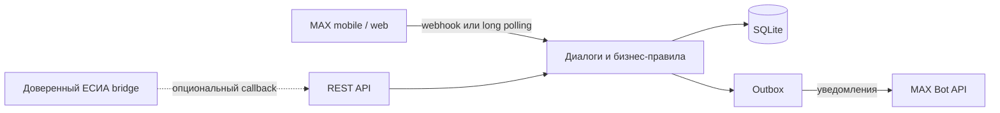

# ДомПульс

**ДомПульс — бот в MAX, который превращает сообщение о проблеме в доме в понятную заявку с ответственным, сроком реакции и видимым результатом.**

Жителю не нужно искать телефон диспетчерской или выяснять в домовом чате, приняли ли его сообщение. Он описывает проблему прямо в MAX, прикладывает фотографию и следит за статусом. Диспетчер работает там же: видит очередь своего дома, отвечает жителю, меняет статус и объединяет повторные сообщения в общий инцидент.

Житель работает в чате MAX, а оператор открывает веб-приложение «Проблемы и показатели» по кнопке бота. Приложение показывает очередь, общие проблемы и показатели дома на телефоне и компьютере.

## Что можно показать на защите

- привязку жителя и диспетчера к дому по одноразовому коду;
- добавление нескольких домов и переключение активного адреса;
- создание обращения с категорией, местом, описанием и фотографиями;
- очередь диспетчера, приоритет, комментарии и смену статусов;
- уведомления жителя и подтверждение результата или возврат заявки в работу;
- объединение похожих обращений в общий инцидент только после решения диспетчера;
- объявления, сведения об управляющей компании и показатели дома;
- контроль времени первой реакции по SLA.

## Какую проблему решает проект

Типичная ситуация начинается просто: в подъезде течёт труба, не работает лифт или пропало отопление. Житель пишет в общий чат. Через несколько сообщений уже непонятно, зарегистрирована ли проблема, кто ею занимается и когда ждать результат. Соседи создают дубли, а диспетчер вручную собирает контекст из переписки.

ДомПульс заменяет этот разрозненный процесс одним коротким маршрутом:

```text
сообщение жителя → зарегистрированная заявка → реакция УК → работа → проверка результата жителем
```

Основная аудитория MVP — жители многоквартирных домов, которые уже пользуются MAX. Вторая сторона сценария — диспетчеры УК и ТСЖ. Для них бот создаёт общую очередь и историю действий без перехода в отдельную систему.

## Основной пользовательский сценарий

1. Житель запускает бота и подтверждает дом одноразовым кодом УК. В будущем этот шаг может проходить через официальный контур ЕСИА.
2. В меню он нажимает **«Сообщить о проблеме»**, выбирает категорию, указывает место, описывает ситуацию и при необходимости прикладывает фото.
3. Перед отправкой бот показывает итог. Заявка создаётся только после подтверждения жителя.
4. Диспетчер открывает **«Проблемы и показатели» → «Очередь»**, отвечает жителю, назначает срочность и ведёт заявку по этапам: `новое → принято → в работе → ожидает проверки`.
5. Житель получает уведомления в MAX и выбирает: **«Да, всё решено»** или **«Проблема осталась»**.
6. Если несколько жителей сообщают об одной проблеме, диспетчер может подтвердить общий инцидент. Другим жителям бот предлагает добровольно присоединиться или создать отдельную заявку.

Житель может привязать несколько домов. Новые обращения, объявления и информация об УК относятся к выбранному активному дому, а история обращений сохраняется при переключении и отвязке адреса.

## Гипотеза и измеримый эффект

Мы проверяем гипотезу, что структурированный сценарий внутри привычного мессенджера уменьшает время неопределённости для жителя и ручную работу диспетчера с повторами.

На пилоте эффект можно измерять по данным самого ДомПульса:

- медианное время до первой реакции УК;
- доля обращений с реакцией в пределах SLA;
- доля обращений, подтверждённых жителями после выполнения;
- число возвратов в работу;
- число повторных сообщений, объединённых в общие инциденты;
- доля пользователей, завершивших создание заявки.

Это показатели для проверки гипотезы, а не заявленные результаты внедрения. Целевые значения определяются вместе с пилотной УК после фиксации исходного уровня.

## Что уже реализовано

| Возможность | Житель | Диспетчер |
|---|---:|---:|
| Привязка к разрешённому дому | ✓ | ✓ |
| Несколько домов в одном профиле | ✓ | — |
| Заявка с фотографиями | ✓ | просмотр |
| История и карточка обращения | свои заявки | заявки доступных домов |
| Ответ без смены статуса | получает | отправляет |
| Приоритет и жизненный цикл | видит | управляет |
| Подтверждение результата | ✓ | получает результат |
| Общие инциденты | присоединяется добровольно | подтверждает |
| Объявления дома | читает | публикует |
| Информация об УК | читает | настраивается администратором |
| SLA и показатели | — | ✓ |

## Быстрый запуск без Docker

Понадобятся Python 3.12+, токен бота MAX и PowerShell. Из корня репозитория выполните:

```powershell
python -m venv .venv
.\.venv\Scripts\python.exe -m pip install -r requirements-dev.txt
Copy-Item .env.example .env
notepad .env
```

В `.env` достаточно заполнить токен:

```dotenv
MAX_BOT_TOKEN=ваш_токен_бота
```

Создайте синтетические данные и два кода доступа к первому дому:

```powershell
.\.venv\Scripts\python.exe -m app.seed --db .local/dompulse.db
.\.venv\Scripts\python.exe -m app.enrollment --db .local/dompulse.db --house-id synthetic-house-01-1 --role resident
.\.venv\Scripts\python.exe -m app.enrollment --db .local/dompulse.db --house-id synthetic-house-01-1 --role operator
```

Запустите бота:

```powershell
.\.venv\Scripts\python.exe -m app.polling
```

Откройте своего бота в MAX, отправьте `/start`, затем введите выданный код в формате `/код XXXX-XXXX-XXXX-XXXX`. Для демонстрации обеих ролей нужны два аккаунта MAX либо два участника команды.

Если у бота раньше был настроен webhook, переключите его на локальный polling:

```powershell
.\.venv\Scripts\python.exe -m app.polling --delete-webhooks
```

Останавливается бот сочетанием `Ctrl+C`, повторный запуск выполняется той же командой `python -m app.polling`. Одновременно для одного токена и одной базы следует использовать только один транспорт: polling или webhook.

## Запуск в Docker

Понадобятся Docker Engine с Compose, VPS с открытыми портами 80 и 443, DNS-запись для поддомена Mini App и заполненный `.env`. Скопируйте `.env.example` в `.env`, укажите действующий `MAX_BOT_TOKEN`, имя бота без `@` в `MAX_BOT_USERNAME`, непредсказуемый секрет в `MAX_WEBHOOK_SECRET`, домен в `CADDY_DOMAIN` и почту в `ACME_EMAIL`. В `MINIAPP_PUBLIC_URL` укажите тот же адрес с путём `/miniapp`, например `https://app.ваш-домен.ru/miniapp`. Символ `_` в доменном имени недопустим. Значение `MAX_API_BASE` из примера подходит для обычного подключения. Секрет можно получить командой `python -c "import secrets; print(secrets.token_urlsafe(32))"`; результат внесите в `.env`. Если бот уже запущен локальной командой `python -m app.polling`, остановите этот процесс перед запуском того же токена в Docker.

Первый раз создайте тестовую базу и коды:

```powershell
docker compose run --rm api python -m app.seed --db /data/dompulse.db
docker compose run --rm api python -m app.enrollment --db /data/dompulse.db --house-id synthetic-house-01-1 --role resident
docker compose run --rm api python -m app.enrollment --db /data/dompulse.db --house-id synthetic-house-01-1 --role operator
```

Одна команда запускает на VPS все компоненты для демонстрации через polling:

```powershell
docker compose --profile polling --profile vps up --build -d
```

Команда запускает API, Mini App, Caddy и `max-polling`; они используют одну SQLite-базу в томе `dompulse-data`. Caddy принимает запросы на 80 и 443, автоматически получает и продлевает сертификат ACME для `CADDY_DOMAIN`, а затем передаёт запросы Mini App во внутреннюю сеть Docker. Основной API остаётся доступен только на `127.0.0.1:8080` сервера. Сам бот остаётся доступен пользователям **в MAX**, пока работает контейнер `max-polling` и есть соединение с MAX Bot API. Открывайте чат бота в приложении MAX или его веб-версии, а не только локальный Swagger.

Проверить состояние и посмотреть журнал:

```powershell
docker compose --profile polling --profile vps ps
docker compose --profile polling logs -f max-polling
```

Остановка и повторный запуск:

```powershell
docker compose --profile polling --profile vps down
docker compose --profile polling --profile vps up -d
```

Данные остаются в именованном томе `dompulse-data`. Команда `down -v` удаляет и тестовую базу, поэтому для обычной остановки она не нужна.

### Внешний сервис, необходимый для проверки

MAX Bot API нельзя воспроизвести внутри Docker: он принимает сообщения пользователей и доставляет ответы бота. Для проверки нужны созданный и доступный в MAX бот, действующий токен этого бота, интернет-доступ контейнера к `https://platform-api2.max.ru` и два аккаунта MAX для одновременной проверки ролей жителя и диспетчера. После запуска проверьте `docker compose --profile polling --profile vps ps`, затем отправьте боту `/start` в MAX. Если MAX недоступен или токен неверен, локальные API и SQLite могут работать, но основной пользовательский сценарий проверить нельзя. ЕСИА и Геокодер Яндекса для этого сценария не требуются: привязка к дому выполняется одноразовым кодом УК.

## Mini App жителя и оператора

Mini App обслуживается тем же FastAPI по пути `/miniapp`; интерфейс и API используют одну базу с ботом. В меню оператора три кнопки «Очередь дома», «Общие проблемы дома» и «Показатели дома» заменены одной кнопкой **«Проблемы и показатели»**. Внутри приложения доступны фильтры очереди, карточка обращения, ответ жителю, смена статуса и срочности, подтверждение общего инцидента, графики и числовые значения показателей.

Оператор назначается одному округу; один округ могут обслуживать несколько операторов. Mini App показывает только дома этого округа и позволяет искать адрес в списке. В профиле диспетчера указан округ без привязки к одному дому. Кнопка «Выйти из аккаунта» в меню оператора после подтверждения удаляет привязку MAX и сеансы Mini App; для повторного входа нужен новый код УК. История заявок сохраняется. Объявления по-прежнему создаются через кнопку бота: если в округе несколько домов, перед вводом заголовка оператор выбирает адрес.

Для просмотра оформления без входа в MAX откройте `http://127.0.0.1:8080/miniapp?preview=1` после запуска API. Режим просмотра показывает только вымышленные данные и не сохраняет действия.

В настройках бота на платформе MAX для партнёров укажите значение `MINIAPP_PUBLIC_URL`, например `https://app.ваш-домен.ru/miniapp`, а в `.env` задайте `MAX_BOT_USERNAME`. В меню оператора кнопка **«Проблемы и показатели»** открывает Mini App внутри MAX. Житель открывает то же Mini App системной кнопкой MAX и видит только свои подтверждённые дома, обращения и объявления. Он может выбрать дом, создать заявку, написать диспетчеру, подтвердить решение или вернуть заявку в работу. Доступ проверяется по подписанным данным запуска MAX и привязке к дому; действия оператора жителю недоступны. MAX передаёт подписанные данные запуска, сервер проверяет подпись токеном бота и роль привязанного оператора; код вручную вводить не требуется. При каждой операции сервер заново проверяет роль и доступ к дому.

При открытии публичной HTTPS-ссылки во внешнем браузере без кнопки бота данных запуска MAX нет, поэтому доступ к данным закрыт. Оператор открывает Mini App через кнопку в чате бота или системную кнопку MAX.

Публичный вход Mini App работает во внутренней сети Docker. Он отдаёт страницу, ограниченный набор REST-методов для проверки, `/health` и `/openapi.json`. Доступ к заявкам и показателям требует подписи MAX либо действующего Bearer-токена тестовой роли; webhook и `/docs` закрыты. На VPS Caddy публикует этот вход по адресу `https://<CADDY_DOMAIN>/miniapp`.

## Пошаговая проверка

1. Житель вводит свой код и получает главное меню.
2. Нажимает **«Сообщить о проблеме»** и создаёт заявку, например: отопление, подъезд 1, «Холодные батареи со вчерашнего дня».
3. Бот отвечает: `Обращение №… зарегистрировано и передано в очередь дома`.
4. Диспетчер привязывает профиль кодом УК и нажимает **«Проблемы и показатели»** в чате бота. Mini App открывается внутри MAX сразу с очередью и показателями дома, без отдельного кода входа.
5. Диспетчер отправляет ответ, принимает заявку, переводит её в работу и отмечает выполненной.
6. Житель видит историю и подтверждает решение либо возвращает заявку.
7. Для проверки нескольких домов выпустите жителю второй код с `--house-id synthetic-house-01-2`, откройте **«Мои дома»** и переключите активный адрес.
8. Для проверки общего инцидента создайте похожие обращения от двух жителей, затем подтвердите найденное совпадение во вкладке **«Общие проблемы»** Mini App.

Ожидаемый результат: новая заявка появляется в очереди своего дома; действия диспетчера и его ответ видны жителю; после отметки о выполнении житель подтверждает результат или возвращает заявку в работу. В «Показателях дома» диспетчер видит число активных и аварийных заявок, нарушения срока первой реакции, среднее время ответа, долю ответов в пределах SLA, частые категории и проблемные места. До появления подходящих заявок значения времени и SLA показываются как «ещё нет данных». Опубликованное диспетчером объявление появляется у жителей этого дома и в блоке последних объявлений показателей. При создании похожих обращений бот предлагает общий сигнал; объединение выполняется только после решения диспетчера.

Расширенный сценарий защиты: [docs/demo-scenario.md](docs/demo-scenario.md).

## Архитектура


```mermaid
flowchart LR
    MAX[MAX mobile / web] -->|webhook или long polling| BOT[Диалоги и бизнес-правила]
    API[REST API] --> BOT
    BOT --> DB[(SQLite)]
    BOT --> OUTBOX[Outbox]
    OUTBOX -->|уведомления| MAXAPI[MAX Bot API]
    BRIDGE[Доверенный ЕСИА bridge] -. опциональный callback .-> API
```

Проект сделан как модульный монолит. REST API и транспорт MAX используют одни правила доступа и одну модель заявок. Входящее событие, состояние диалога и исходящий ответ записываются транзакционно; повторные сообщения MAX дедуплицируются. Outbox отдельно доставляет уведомления и повторяет временно неудачные запросы.

Основные компоненты:

- `app/max_webhook.py` — сценарии жителя и диспетчера;
- `app/polling.py` — локальный запуск бота без публичного сервера;
- `app/api.py` — REST API, webhook и интеграционные точки;
- `app/outbox.py` — доставка сообщений в MAX;
- `app/db.py` и `app/models.py` — схема SQLite и контракты;
- `app/sla.py` и `app/analytics.py` — сроки первой реакции и показатели;
- `tests/` — проверки API, MAX, polling, ролей и безопасности.

Подробное описание: [docs/architecture.md](docs/architecture.md).

## Окружение, порты и зависимости

| Параметр | Значение |
|---|---|
| Python | 3.12+ |
| Docker | Docker Engine с Compose v2 |
| Локальная база | SQLite, по умолчанию `.local/dompulse.db` |
| HTTP API | `127.0.0.1:8080` |
| Mini App и публичный API | `127.0.0.1:8081` |
| Swagger UI | `http://127.0.0.1:8080/docs` |
| Health check | `http://127.0.0.1:8080/health` |
| Входящие порты для polling | не требуются |
| Входящие порты VPS для Mini App | 80 и 443 |

Версии Python-библиотек зафиксированы в [requirements.txt](requirements.txt), зависимости разработки — в [requirements-dev.txt](requirements-dev.txt). Основные библиотеки: FastAPI, Uvicorn, HTTPX, aiosqlite и certifi.

## Переменные окружения

| Переменная | Обязательна | Назначение |
|---|---:|---|
| `MAX_BOT_TOKEN` | да | токен бота MAX |
| `MAX_BOT_USERNAME` | для Mini App | публичное имя того же бота из `GET /me`, без символа `@`; передаётся в кнопке `open_app` |
| `MINIAPP_PUBLIC_URL` | необязательно | публичный HTTPS-адрес страницы `/miniapp`; URL Mini App должен быть указан в настройках бота MAX |
| `MAX_API_BASE` | нет | адрес MAX API; по умолчанию `https://platform-api2.max.ru` |
| `DOMPULSE_DB` | нет | путь к SQLite; по умолчанию `.local/dompulse.db` |
| `MAX_WEBHOOK_SECRET` | для API/webhook и Docker | секрет проверки входящего webhook |
| `CADDY_DOMAIN` | для Docker на VPS | публичное доменное имя Mini App без `https://` |
| `ACME_EMAIL` | для Docker на VPS | почта для уведомлений центра сертификации ACME |
| `GOSUSLUGI_BRIDGE_URL` | нет | HTTPS-адрес доверенного адаптера ЕСИА |
| `GOSUSLUGI_BRIDGE_SECRET` | вместе с bridge URL | HMAC-секрет длиной не менее 32 символов |
| `YANDEX_MAPS_API_KEY` | нет | ключ Геокодера Яндекса для проверки адреса |
| `YANDEX_GEOCODER_URL` | нет | адрес API геокодера |
| `YANDEX_MAPS_ALLOW_STORAGE` | нет | разрешение сохранять ответ геокодера при подходящей лицензии |
| `SSL_CERT_FILE`, `SSL_CERT_DIR` | нет | доверенный CA для нестандартной локальной среды |

Реальные токены, секреты, `.env`, локальные базы и сертификаты не добавляются в Git.

## Реальные и модельные интеграции

| Контур | Статус в MVP | Как проверить |
|---|---|---|
| MAX Bot API | реальная интеграция | запуск через polling или webhook с выданным токеном |
| SQLite | реальное локальное хранилище | создаётся командой `app.seed` |
| REST API | локальный, Mini App доступен по HTTPS через Caddy | Swagger и `openapi.json` |
| Госуслуги / ЕСИА | подготовлена граница доверенного bridge; официальный OAuth не входит в репозиторий | без bridge используется одноразовый код УК |
| Геокодер Яндекса | опциональная реальная проверка адреса при наличии ключа | без ключа основной сценарий продолжает работать по коду УК |
| ГИС ЖКХ и внутренняя система УК | не подключены и не имитируются | данные УК и домов в seed синтетические |

ДомПульс не выдаёт ручной ввод адреса за подтверждение права проживания. Геокодер проверяет адрес, после чего всё равно требуется код УК. Для промышленного подключения Госуслуг нужны зарегистрированная информационная система, полномочия ЕСИА и внешний аттестованный адаптер.

## Работа с данными и доступом

- Команда `app.seed` создаёт новую базу, локальные токены в `.local/local-test-users.json` и примеры домов, заявок и объявлений для всех 12 округов Москвы. Адреса и сведения УК синтетические и не подтверждают обслуживание реальных домов. Для замены учебных записей в существующей базе используйте `python -m app.synthetic_data --db .local/dompulse.db`: команда сохраняет привязки пользователей MAX. Перед обновлением рабочей базы сделайте резервную копию SQLite.
- Житель видит свои обращения во всех подтверждённых домах. Диспетчер видит только назначенные ему дома или округа.
- Московские адреса сравниваются без учёта регистра, пунктуации, слова «дом» и необязательного префикса «Москва». В списках они показываются как «Москва, Название улицы, дом N». При запуске существующие подписи домов приводятся к этому виду без изменения ID дома и связанных заявок. Для адреса в другом городе город нужно указывать явно.
- Коды привязки имеют срок действия и ограничение числа использований; в базе хранится хеш кода.
- Фотографии передаются как вложения MAX. В SQLite сохраняются идентификаторы и метаданные, бинарные файлы не копируются.
- При `YANDEX_MAPS_ALLOW_STORAGE=false` ответ Геокодера Яндекса не сохраняется.
- Bridge ЕСИА передаёт минимальный адресный claim через HMAC-подписанный callback; токены ЕСИА и полный адрес квартиры в ДомПульсе не хранятся.

Подробнее: [docs/data-and-integrations.md](docs/data-and-integrations.md).

## REST API и тесты

REST API нужен для интеграций и технической проверки; основной пользовательский путь проходит в MAX.

```powershell
$env:DOMPULSE_DB='.local/dompulse.db'
$env:MAX_WEBHOOK_SECRET='локальный-секрет-длиной-не-менее-32-символов'
.\.venv\Scripts\python.exe -m uvicorn app.api:create_app --factory --host 127.0.0.1 --port 8080
```

Контракт находится в [openapi.json](openapi.json), описание тестовых запросов — в [DATA-API.yaml](DATA-API.yaml). Экспорт и тесты:

```powershell
.\.venv\Scripts\python.exe scripts/export_openapi.py
.\.venv\Scripts\python.exe -m pytest -q
```

Автотесты используют имитацию сетевых ответов MAX, но проверяют фактические URL, заголовок авторизации, дедупликацию событий, polling marker, outbox, роли и отсутствие секретов в ошибках. Реальное подключение к MAX проверяется отдельно с токеном команды.

## Ограничения MVP

- SQLite подходит для пилота и демонстрации, но не для большого числа параллельных записей.
- Нет production-мигратора схемы, rate limiting REST API и полноценной наблюдаемости.
- При неопределённом сетевом результате между отправкой MAX-сообщения и фиксацией ответа возможен повтор.
- Официальный OAuth Госуслуг, ГИС ЖКХ и внутренние системы УК требуют отдельных соглашений и доступа.
- Для встроенного Mini App нужен публичный HTTPS-адрес, сохранённый в настройках бота на платформе MAX для партнёров. При открытии через MAX оператор входит автоматически по проверенной подписи запуска.

Полный список: [docs/known-limitations.md](docs/known-limitations.md).

## Пилот и масштабирование

Предлагаемый первый пилот — одна управляющая организация и несколько домов. До запуска фиксируется исходный способ обработки обращений, затем сравниваются время первой реакции, доля соблюдённых SLA, возвраты заявок и объём повторов. По итогам пилота уточняются категории проблем, сроки и регламент диспетчеров.

При масштабировании сохраняются сценарии MAX, модель заявки, роли, журнал событий и аналитика. Для новой УК меняются справочник домов, сотрудники, SLA, категории и интеграционный адаптер. Следующий технический этап — PostgreSQL, управляемые миграции, отзыв сессий, наблюдаемость и интеграция с рабочей системой УК. Для масштабирования Mini App потребуется постоянный HTTPS-хостинг и общая база с ботом.

## Материалы проекта

- [Архитектура](docs/architecture.md)
- [Данные и интеграции](docs/data-and-integrations.md)
- [Демонстрационный сценарий](docs/demo-scenario.md)
- [Известные ограничения](docs/known-limitations.md)
- [Чек-лист сдачи](docs/submission-checklist.md)
- [OpenAPI](openapi.json)
- [Описание API и тестовых данных](DATA-API.yaml)

## Развёртывание на VPS

Создайте у регистратора DNS-запись `A` для поддомена, который указали в `CADDY_DOMAIN`, направив её на IP VPS. Откройте на сервере и в облачном firewall порты 80 и 443. Затем заполните `.env` и запустите:

```powershell
docker compose --profile polling --profile vps up --build -d
```

Caddy сам подтверждает домен через ACME, выпускает сертификат и продлевает его в томе `caddy-data`. Проверка после запуска:

```powershell
docker compose --profile polling --profile vps ps
docker compose logs -f caddy
```

В настройках MAX укажите `https://<CADDY_DOMAIN>/miniapp`. После изменения домена перезапустите стек: `docker compose --profile polling --profile vps up -d`. Для серверного запуска не нужны ngrok, Cloudflare Tunnel и постоянно включённый домашний компьютер.

## Доступ к проверяемой версии

- Бот MAX: https://max.ru/t196_hakaton_max_bot — отправьте /start и откройте кнопку Mini App в чате. Для работы нужны запущенные бот, Mini App и Caddy на VPS.
- Mini App: https://app.dom-pulse.ru/miniapp — вход выполняется из MAX по подписанным данным запуска. Прямой вход в браузере без MAX не даёт доступ к личным данным.
- Проверяемый REST API: https://app.dom-pulse.ru, проверка доступности — https://app.dom-pulse.ru/health, спецификация OpenAPI 3.1 — https://app.dom-pulse.ru/openapi.json. Контракт проверок — [DATA-API.yaml](DATA-API.yaml).
- Исходный код: https://github.com/NENN111/DomPulse. Для сдачи зафиксируйте полный hash командой git rev-parse HEAD после последнего коммита и укажите его в форме заявки. После дедлайна не меняйте указанную версию.

### Тестовые роли и данные

Синтетические адреса 12 округов, роли и ID домов находятся в [test-data/demo.json](test-data/demo.json). Генератор [app/synthetic_data.py](app/synthetic_data.py) создаёт заявки, события и объявления. На чистой базе python -m app.seed --db <путь> создаёт данные и два Bearer-токена в local-test-users.json рядом с базой. Для уже заполненной демонстрационной базы команда python -m scripts.issue_evaluation_tokens --db .local/dompulse.db --output .local/evaluation-accounts.json выдаёт отдельные токены жителю синтетического дома ЦАО и оператору его округа. Выдача заменяет только их прежние Bearer-токены, не затрагивая привязки MAX.

Файл с токенами исключён из Git. Передайте его проверяющим отдельно через защищённое поле заявки; публичная публикация сделала бы тестовые роли доступными посторонним. Для входа в MAX каждой роли нужны два отдельных аккаунта MAX и одноразовые коды привязки, выданные для тестового дома через app.enrollment. Токены REST API не являются кодами входа в MAX.

Порядок проверки REST API: выполните GET /health, затем GET /api/me с токенами каждой роли, GET /api/tickets и GET /api/tickets/{id} с токеном жителя, где id взят из его списка. Создайте заявку жителем через POST /api/tickets; сохраните её id и version. Оператором добавьте комментарий, затем примите заявку через POST /api/tickets/{id}/status, передав актуальную version. Проверьте, что житель видит новую запись и ответ, а GET /api/metrics/house доступен оператору. Чужая заявка для жителя возвращает 404, запрос без токена — 401. Подробные тела и поля ответов указаны в [DATA-API.yaml](DATA-API.yaml).

Для Docker на VPS заполните `.env` по [.env.example](.env.example) и выполните **одну команду** `docker compose --profile polling --profile vps up --build -d`. Она запускает API, Mini App, Caddy и обработчик сообщений MAX с общей SQLite-базой. API слушает `127.0.0.1:8080`, Mini App доступен Caddy во внутренней сети Docker, а Caddy принимает HTTPS на 80 и 443. Для повторного запуска: `docker compose --profile polling --profile vps up -d`; для остановки: `docker compose --profile polling --profile vps down`. Том с данными при обычной остановке сохраняется.

Внешние сервисы, которые не воспроизводятся в Docker: MAX Bot API для сообщений и запуска Mini App, DNS домена и действующий токен бота. Для проверки в MAX в настройках партнёрской платформы должен быть указан `https://<CADDY_DOMAIN>/miniapp`. Caddy выпускает HTTPS-сертификат после того, как DNS-запись указывает на VPS и порты 80 и 443 доступны извне. Яндекс Геокодер и bridge ЕСИА для основного сценария не требуются.

Сборку Docker можно проверить командой docker compose build; локальная проверка командой python -m pytest -q. Время сборки до пяти минут требует проверки на работающем Docker Engine: скорость зависит от среды и первой загрузки базового образа.
